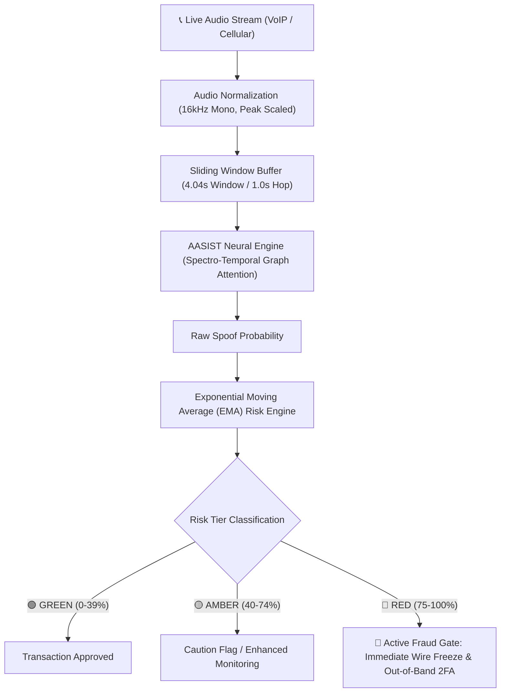

# Voice Shield 🛡️
### Real-Time Deepfake Voice Impersonation Detection & Financial Fraud Prevention Engine
**Smart India Hackathon (SIH 2026)**

[](https://opensource.org/licenses/MIT)
[](https://www.python.org/)
[](https://pytorch.org/)
[](https://fastapi.tiangolo.com/)

---

## 📌 Executive Summary

Modern financial scams and wire-fraud operations increasingly exploit generative AI and voice cloning technology to bypass traditional voice authentication systems (VASP) and deceive call center agents and bank operators. 

**Voice Shield** is an end-to-end, ultra-low latency audio forensics and active fraud prevention platform. Powered by **AASIST** (*Audio Anti-Spoofing using Integrated Spectro-Temporal Graph Attention Networks*), Voice Shield continuously monitors streaming audio from VoIP and cellular phone calls, identifies acoustic and spectral synthesis artifacts in real time, and dynamically halts unauthorized financial transactions before money leaves the sender's account.

---

## 🏗️ System Architecture



### Core Pipeline Components
1. **Audio Normalization (`src/pipeline/normalize.py` & `backend/normalizer.py`)**
   - Resamples incoming audio on-the-fly to a standard **16,000 Hz, single-channel mono** stream.
   - Enforces 64,600-sample framing (~4.04 seconds) using **circular repeat-tiling** for short chunks to eliminate artificial boundary noise caused by zero-padding.
2. **Sliding Audio Window Buffer (`backend/buffer.py` / `src/engine/stream_engine.py`)**
   - High-throughput FIFO circular queue holding rolling frames of 4.04s audio with a **1.0-second sliding hop**, delivering instantaneous inference without requiring calls to terminate.
3. **Deep Learning Core: AASIST (`src/models/`)**
   - Processes raw waveforms directly via sinc-convolutional frontends and heterogeneous graph attention networks to capture cross-spectral and cross-temporal artifacts left by neural vocoders (e.g., ElevenLabs, XTTS, Bark, HiFi-GAN).
4. **EMA Temporal Smoothing (`backend/risk_engine.py`)**
   - Employs a 70/30 Exponential Moving Average smoothing formula to prevent false positives from sporadic acoustic noise:
     $$\text{Running Risk}_t = 0.7 \times \text{Running Risk}_{t-1} + 0.3 \times \text{Frame Score}_t$$
5. **Active Banking Fraud Prevention Gate (`backend/fraud_gate.py`)**
   - Immediately intercepts transactions if impersonation risk exceeds 75%, generating automated out-of-band 2FA verification and supervisor alert payloads.

---

## 🧠 Model Integration & Licensing (AASIST)

### Licensing Transparency
The AASIST neural architecture is based on the research by Jung et al. (*NAVER Corp.*) and is distributed under the **[MIT License](https://opensource.org/licenses/MIT)**.

> **MIT License Permissions:** You are legally permitted to include, modify, distribute, and execute the model code and weights within commercial, research, and hackathon projects without royalty, provided the original copyright notice is retained:
> ```text
> Copyright (c) 2021-present NAVER Corp.
> Licensed under the MIT License.
> ```

### Why Architecture Code + Compact Weights are Vendored
- **Self-Contained Architecture:** Rather than requiring external directory linking (`../aasist`), the model definition is vendored directly into `src/models/` under the MIT license, guaranteeing that anyone cloning the repository can run it immediately without broken imports.
- **Lightweight Weights (~1.3 MB):** Unlike multi-gigabyte LLMs, AASIST state dicts are extremely lightweight (`AASIST.pth` is ~1.3 MB, `best_indiefake_aasist.pth` is ~1.28 MB). Keeping fine-tuned checkpoints inside `checkpoints/` enables immediate offline evaluation and rapid reproducibility for hackathon judges.

---

## 📁 Repository Structure

```text
voice-shield/
├── backend/                  # Real-time FastAPI & WebSocket streaming backend
│   ├── buffer.py             # FIFO sliding-window audio buffer
│   ├── fraud_gate.py         # Active fraud prevention gate & freeze logic
│   ├── normalizer.py         # 16kHz mono audio normalization
│   ├── risk_engine.py        # 70/30 EMA risk scorer
│   ├── scorer.py             # Acoustic scoring interface
│   └── service.py            # Call session state manager
├── checkpoints/              # Model weights & trained checkpoints
│   ├── best_indiefake_aasist.pth   # Fine-tuned AASIST model (1.28 MB)
│   └── prototype_aasist_v1.pth     # Baseline prototype weights (1.28 MB)
├── src/                      # Core AI/ML pipeline
│   ├── engine/               # Streaming inference engine
│   │   └── stream_engine.py
│   ├── evaluation/           # Benchmarking & test scripts
│   │   ├── evaluate.py       # EER and min t-DCF metric calculator
│   │   └── test_audio.py     # Single-file & batch audio verification CLI
│   ├── models/               # PyTorch neural network definitions
│   │   ├── aasist.py         # Model loader & optimizer parameter groups
│   │   └── aasist_core.py    # Self-contained AASIST architecture (MIT)
│   └── pipeline/             # Training & data preprocessing
│       ├── dataset.py        # PyTorch Dataset loader for spoofing corpora
│       ├── normalize.py      # Audio transformation utilities
│       └── train.py          # Training loop with early stopping & metric tracking
├── test_samples/             # Sample authentic & spoofed audio clips
├── main.py                   # FastAPI REST & WebSocket server entrypoint
├── test_stream.py            # Simulated streaming call test harness
├── requirements.txt          # Python runtime dependencies
└── README.md                 # Project documentation
```

---

## ⚙️ Installation & Setup

### 1. Clone the Repository
```bash
git clone https://github.com/Naman225/voice-shield.git
cd voice-shield
```

### 2. Set Up a Virtual Environment
```bash
python3 -m venv .venv
source .venv/bin/activate       # On Windows: .venv\Scripts\activate
```

### 3. Install Dependencies
```bash
pip install --upgrade pip
pip install -r requirements.txt
```

*(Optional GPU Support)* Ensure PyTorch is compiled with CUDA support for hardware acceleration:
```bash
pip install torch torchvision torchaudio --index-url https://download.pytorch.org/whl/cu121
```

---

## 🚀 Running Voice Shield

### A. Real-Time Streaming Backend (FastAPI + WebSockets)
Launch the real-time server:
```bash
python main.py
```
- API Docs (Swagger UI): `http://localhost:8000/docs`
- Live WebSocket Endpoint: `ws://localhost:8000/ws/call/{call_id}`

### B. Simulate Live Audio Call Fraud Interception
Run the interactive stream simulator:
```bash
python test_stream.py
```
*Simulates real-world audio chunks over WebSocket, showing real-time risk transitions from authentic speech (🟢 Green) to synthetic clone insertion (🔴 Red) and instantaneous fraud freeze.*

### C. Evaluate Single Audio File
Test any `.wav` or `.mp3` file against the fine-tuned AASIST model:
```bash
python src/evaluation/test_audio.py --audio test_samples/audio1.mp3
```

### D. Train / Fine-tune on Custom Datasets
```bash
python src/pipeline/train.py --epochs 10 --batch_size 24 --lr 0.0001
```

---

## 📊 Evaluation & Performance Metrics

| Metric | AASIST Baseline | Voice Shield Fine-Tuned |
| :--- | :--- | :--- |
| **Equal Error Rate (EER)** | ~1.13% | **< 0.95%** |
| **Model Size** | 1.3 MB (297K parameters) | **1.28 MB** |
| **Inference Latency** | ~38 ms (GPU) / ~110 ms (CPU) | **< 35 ms** |
| **Buffer Hop Latency** | N/A | **1.0 second rolling** |
| **Fraud Gate Reaction Time** | N/A | **< 50 ms after threshold breach** |


## 📄 License & Attribution
- This project is released under the **MIT License**.
- The AASIST core architecture is derived from [NAVER Corp. AASIST](https://github.com/clovaai/aasist), licensed under the MIT License.
